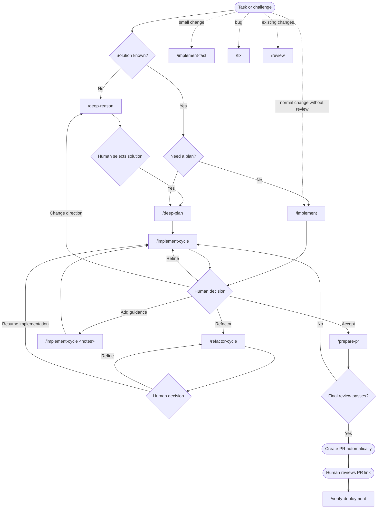

# opencode-setup

Personal opencode configuration for human-directed agentic software development.

The setup separates solution selection, execution planning, implementation, independent review, and delivery readiness. Agents work autonomously within each stage; the human controls transitions to prevent goal drift and unapproved iteration.

## Philosophy

AI agents are effective at bounded technical work, but long autonomous runs compound assumptions. An agent may remain locally consistent while gradually solving a different problem, expanding scope, or treating its own implementation choices as requirements.

This workflow controls that risk through explicit boundaries:

- **Reason before planning** when the solution is unclear. The agent compares options, but the human chooses the direction.
- **Plan only the selected solution.** Rejected alternatives are removed from implementation context so they do not distract or influence later work.
- **Implement complete cohesive outcomes.** The agent remains bounded by requested scope, but does not artificially stop after a tiny plan item.
- **Use bounded review.** Cycle review is a fast, tool-free patch drift check; every proposed delivery still receives a thorough independent final review.
- **Keep decisions human-controlled.** The human accepts the result, requests review or refinement, adds constraints, or changes direction.
- **Evaluate delivery separately.** A technically correct implementation still passes a final PR-readiness gate for scope, evidence, and delivery concerns.

The approach combines agent autonomy with proportional, evidence-based checkpoints. Agents retain enough freedom to complete cohesive work efficiently, while humans retain authority over intent, trade-offs, scope, review depth, and acceptance.

## Workflow



Use `/implement` as the default path for a clear task. Use `/deep-plan` → `/implement-cycle` when the task benefits from a canonical plan or staged refinement. Add `/deep-reason` first only when the solution direction is genuinely unresolved.

## Core Handoffs

- `/deep-reason` stays high-level: decision, material constraints, realistic options, trade-offs, recommendation, and human choice. It does not plan execution.
- `/deep-plan` keeps only the selected solution and produces a concise, codebase-aligned plan: goal, scope, approach, 4–8 tasks, proportional verification, and genuine blockers.
- The plan supersedes rejected alternatives as implementation context. `/implement-cycle` revalidates repository details but does not reopen the selected solution unless it proves infeasible or unsafe.
- `/implement-cycle` completes the largest cohesive verified portion of the requested outcome. It does not artificially restrict implementation to one plan item or require review ceremony for ordinary changes.
- The optional cycle reviewer receives only the current objective, relevant constraints, supplied patch, and verification results. It cannot use tools or inspect broader repository context. `/prepare-pr` performs the thorough final independent review.
- `/refactor-cycle` delegates a behavior-preserving cleanup pass to an isolated refactoring agent. The agent receives no task or cycle context and works only from local code, tests, and conventions, focusing on simplicity, style, consistency, and elegance.

## Cycle Result

Every cycle reports only what is needed for the next human decision:

- **Changed behavior** — completed scope, exclusions, and affected components.
- **Verification** — checks, results, and material evidence gaps.
- **Readiness** — ready, refinement recommended, refinement required, or blocked.
- **Next-cycle checkpoint** — emitted only when required work remains.

For ordinary patches, primary-agent verification and final diff inspection are sufficient. Explicitly requested or risk-triggered cycle review adds one `code-review-intermediate` invocation. It performs a tool-free drift check against supplied patch context and returns at most three findings. Test review does not run during implementation cycles. `/prepare-pr` delegates the complete change to `code-review-final`, and only its validated `ready` verdict opens the PR-creation gate.

If another cycle is needed, the latest compact checkpoint carries forward the unresolved work in the same session:

```text
/implement-cycle
/implement-cycle Keep the public API unchanged and do not add a dependency
```

Review findings are never applied automatically; the human decides whether another cycle is justified.

## Commands

| Command | Purpose |
| --- | --- |
| `/deep-reason` | Compare solutions and support a human technical decision. |
| `/deep-plan` | Convert the selected solution into a focused execution plan. |
| `/implement-cycle` | Execute a canonical plan or refinement checkpoint; optionally run one fast patch drift check. |
| `/refactor-cycle` | Delegate an isolated behavior-preserving refactor focused on code simplicity and elegance. |
| `/implement-fast` | Implement a tiny, obvious, low-risk change with minimal investigation. |
| `/implement` | Default command for a clear task: investigate, implement, and verify. |
| `/fix` | Diagnose and fix a bug with regression verification. |
| `/review` | Perform a standalone read-only code review. |
| `/prepare-pr` | Run final readiness review and automatically create the PR when it passes. |
| `/verify-deployment` | Verify pipeline and deployment state without changing remote systems. |

## Agents

| Agent | Responsibility |
| --- | --- |
| `code-architect-fast` | High-level reasoning and concise execution planning. |
| `code-review-intermediate` | Optional tool-free patch drift check for implementation cycles and `/review`. |
| `test-reviewer` | Optional tool-free test evidence check; not used during implementation cycles. |
| `refactor` | Isolated behavior-preserving refactoring for simplicity, style, consistency, and elegance. |
| `code-review-final` | Final complete-change readiness gate and PR content; its validated `ready` verdict is required for PR creation. |

Specialized agents use default-deny permissions. Cycle reviewers are tool-free and never fix their own findings; the isolated `refactor` agent may make only behavior-preserving local cleanup changes. Cycle verdicts only signal drift; only the final reviewer gates PR creation.

## Boundaries

- Human selection is required before planning when materially different solutions remain.
- Reasoning and planning never implement changes.
- Implementation ignores rejected alternatives after a canonical plan exists.
- Intermediate code/test reviews are optional and advisory; they cannot authorize PR creation.
- `/prepare-pr` creates a PR only after a validated `ready` verdict from `code-review-final`; it never merges or enables auto-merge.
- The created PR URL is returned to the human for manual review.
- `/verify-deployment` does not deploy, roll back, or modify remote systems without explicit instruction.
