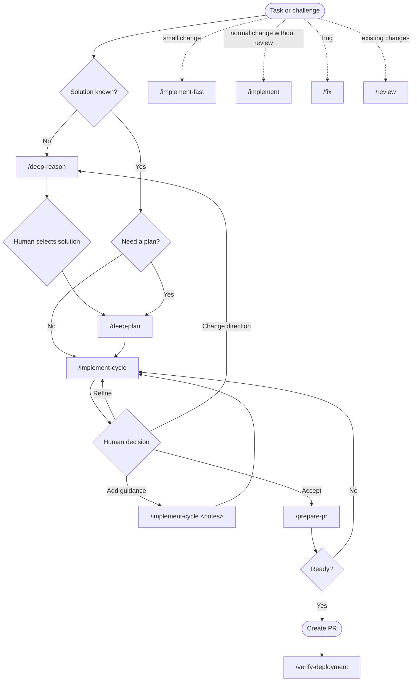

# opencode-setup

Personal opencode configuration for human-directed agentic software development.

The setup separates solution selection, execution planning, implementation, independent review, and delivery readiness. Agents work autonomously within each stage; the human controls transitions to prevent goal drift and unapproved iteration.

## Philosophy

AI agents are effective at bounded technical work, but long autonomous runs compound assumptions. An agent may remain locally consistent while gradually solving a different problem, expanding scope, or treating its own implementation choices as requirements.

This workflow controls that risk through explicit boundaries:

- **Reason before planning** when the solution is unclear. The agent compares options, but the human chooses the direction.
- **Plan only the selected solution.** Rejected alternatives are removed from implementation context so they do not distract or influence later work.
- **Implement in bounded cycles.** Each cycle completes meaningful work, verification, and review, then stops instead of continuing automatically.
- **Use independent review.** Read-only reviewers evaluate code and test readiness without inheriting ownership of the implementation or fixing their own findings.
- **Keep decisions human-controlled.** The human accepts the result, starts another cycle, adds constraints, or changes direction.
- **Evaluate delivery separately.** A technically correct implementation still passes a final PR-readiness gate for scope, evidence, and delivery concerns.

The approach works by combining agent autonomy with frequent, evidence-based checkpoints. Agents retain enough freedom to investigate and implement efficiently, while humans retain authority over intent, trade-offs, scope, and acceptance.

## Workflow



The main path is `/deep-reason` → human selection → `/deep-plan` → `/implement-cycle` → human decision → `/prepare-pr`. Shorter paths are available when reasoning, planning, or independent review is unnecessary.

## Core Handoffs

- `/deep-reason` stays high-level: decision, material constraints, realistic options, trade-offs, recommendation, and human choice. It does not plan execution.
- `/deep-plan` keeps only the selected solution and produces a concise, codebase-aligned plan: goal, scope, approach, 4–8 tasks, proportional verification, and genuine blockers.
- The plan supersedes rejected alternatives as implementation context. `/implement-cycle` revalidates repository details but does not reopen the selected solution unless it proves infeasible or unsafe.
- Each `/implement-cycle` completes exactly one implementation and independent-review iteration, then stops for human judgment.

## Cycle Result

Every cycle presents one human decision package:

- **Scope** — requested and delivered scope, exclusions, and preserved constraints.
- **Implementation** — changed behavior, affected components, and key decisions.
- **Verification** — checks, results, and evidence gaps.
- **Readiness review** — synthesized code/test findings and combined verdict.
- **Next action** — accept, refine, clarify direction, or obtain external verification.

If another cycle is needed, prior plans, accepted findings, decisions, and unresolved work carry forward automatically in the same session:

```text
/implement-cycle
/implement-cycle Keep the public API unchanged and do not add a dependency
```

Review findings are never applied automatically; the human decides whether another cycle is justified.

## Commands

| Command | Purpose |
| --- | --- |
| `/deep-reason` | Compare solutions and support a human technical decision. |
| `/deep-plan` | Convert the selected solution into a focused execution plan. |
| `/implement-cycle` | Complete one implementation, verification, and independent-review cycle. |
| `/implement-fast` | Implement a small, clear, low-risk change directly. |
| `/implement` | Implement and verify without independent reviewers. |
| `/fix` | Diagnose and fix a bug with regression verification. |
| `/review` | Perform a standalone read-only code review. |
| `/prepare-pr` | Evaluate final delivery readiness and prepare PR content. |
| `/verify-deployment` | Verify pipeline and deployment state without changing remote systems. |

## Agents

| Agent | Responsibility |
| --- | --- |
| `code-architect-fast` | High-level reasoning and concise execution planning. |
| `code-review-final` | Independent implementation review. |
| `test-reviewer` | Independent test and verification review. |
| `code-review-intermediate` | Complete-change PR readiness evaluation. |

Specialized agents use default-deny, read-only permissions. Reviewers never fix their own findings.

## Boundaries

- Human selection is required before planning when materially different solutions remain.
- Reasoning and planning never implement changes.
- Implementation ignores rejected alternatives after a canonical plan exists.
- `/prepare-pr` does not create a PR.
- `/verify-deployment` does not deploy, roll back, or modify remote systems without explicit instruction.
